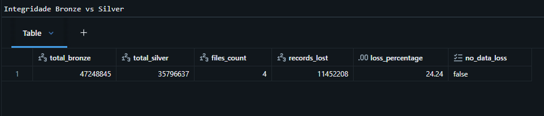
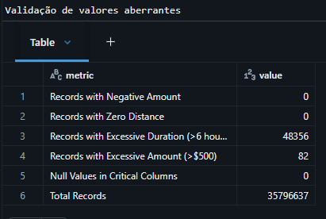
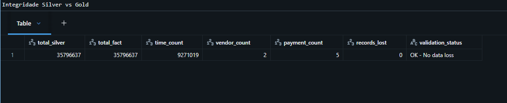
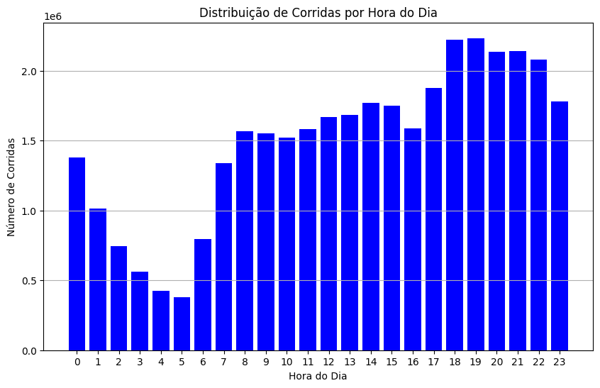
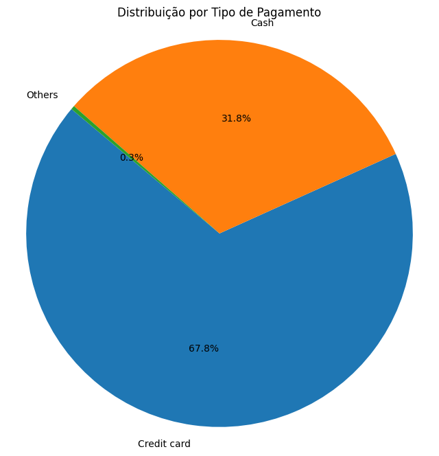
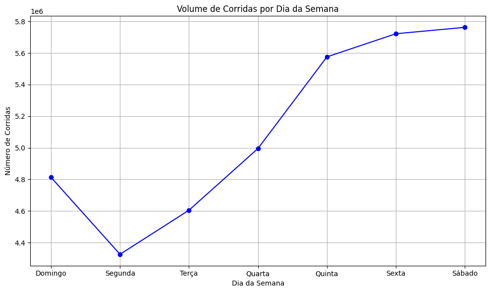
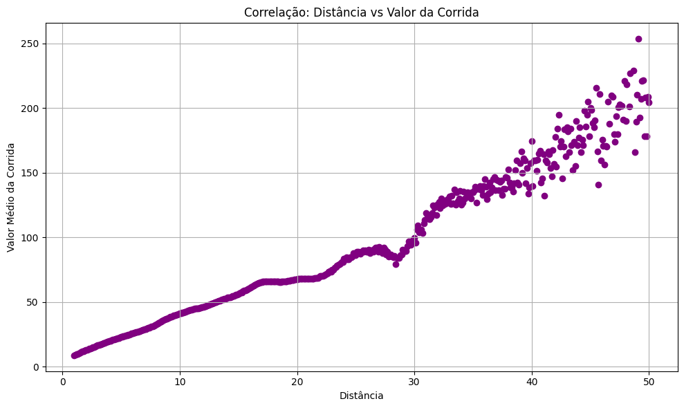

# NYC Taxi Data Pipeline
Projeto de ETL e análise de dados de viagens de taxi usando Databricks e AWS. Este projeto busca demonstrar habilidades em Engenharia de Dados, orquestração, segurança e boas práticas de ETL.

## Dataset

- **Fonte**: https://www.kaggle.com/datasets/elemento/nyc-yellow-taxi-trip-data
- **Descrição**: Este dataset contém informações sobre viagems de taxi realizadas na cidade de Nova York, como tempo de viagem, horário de saída e chegada, distância e localização de saída e chegada.

## Ferramentas utilizadas

- AWS (Armazenamento)
- Databricks Community + Spark (Processamento e Orquestração)

## Instruções de execução

1. Clone o repositório
```bash
git clone https://github.com/rauljpinto/nyc-taxi-data-pipeline.git
```
2. Importe os notebooks no ambiente Databricks
3. Configure o Job usando `infrastructure/job_config.json`
4. Execute o Job manualmente pela UI se necessário
   
## Limitações

O Projeto foi desenvolvido usando licenças gratuitas da AWS e do Databricks, o que trouxe algumas limitações no desenvolvimento:

- **Bucket S3 Público**: O ambiente do Databricks Community só permite acesso a buckets públicos e não possui suporte e integração com IAM Roles, porém ainda é possível utilizar criptografia SSE-S3.
- **Escrita em buckets S3**: O Databricks Community também não permite escrita em buckets S3 devido a restrição de acesso anônimo, então a solução encontrada para o armazenamento das tabelas foi salvar no catálogo do próprio Databricks.

## Limpeza dos dados

Durante a transformação dos dados na camada Silver, foram filtrados dados duplicados e valores extremos como distâncias muito longas e valores de corridas muito altos. A aplicação desses filtros, resultou em uma redução de 24% dos dados.

- Tabela de validação Bronze -> Silver
  


- Tabela com número de valores aberrantes removidos
  


Não houve perda de dados na construção das tabelas finais.

- Tabela de validação Silver -> Gold




## Modelagem dimensional

Foi implementado um star schema para melhor distribuição e visualização dos dados:

- Tabela Fato (f_trips)
```bash
schema = {
    "trip_id": "long",            # Chave primária
    "time_id": "long",            # FK para d_time
    "vendor_id": "int",           # FK para d_vendor  
    "payment_type_id": "int",     # FK para d_payment_type
    "passenger_count": "int",
    "trip_distance": "decimal(8,2)",
    "fare_amount": "decimal(10,2)",
    "tip_amount": "decimal(10,2)",
    "tolls_amount": "decimal(10,2)",
    "total_amount": "decimal(10,2)",
    "trip_duration_minutes": "decimal(8,2)",
    "trip_status": "string",
    "pickup_latitude": "decimal(10,6)",
    "pickup_longitude": "decimal(10,6)",
    "dropoff_latitude": "decimal(10,6)", 
    "dropoff_longitude": "decimal(10,6)"
}
```

- Dimensão Tempo (d_time)
```bash
  schema = {
    "time_id": "long",            # Chave surrogada
    "timestamp": "timestamp",
    "hour": "int",
    "day": "int", 
    "month": "int",
    "year": "int",
    "quarter": "int",
    "day_of_week": "int",
    "is_weekend": "boolean"
}
```

- Dimensão Vendor (d_vendor)
```bash
  schema = {
    "vendor_id": "int",           # Chave natural (1, 2)
    "vendor_name": "string"       # Nome descritivo
}
```

- Dimensão Forma de Pagamento (d_payment_type)

```bash
schema = {
    "payment_type_id": "int",     # Chave natural (1-6)
    "payment_type_name": "string" # Nove descritivo
```

## Análises













